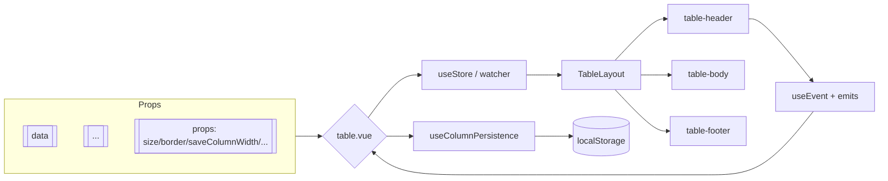
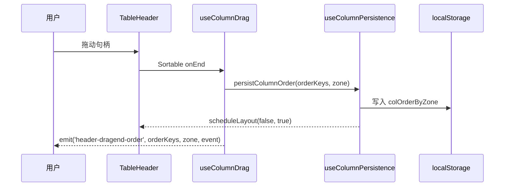

# Element Plus Table 组件源码导读

本文件作为 `packages/components/table` 的整体架构说明，帮助开发者快速了解核心模块、数据流以及近期新增的列宽持久化与列拖动排序能力。

## 目录结构速览

```
table/
├── index.ts                 // 导出 ElTable & ElTableColumn
├── src/
│   ├── table.vue            // 主组件，负责 orchestrate store/layout/render
│   ├── table-column/        // <el-table-column> 定义、渲染、watcher
│   ├── table-header/        // 表头（事件、样式、拖拽、列工具等）
│   ├── table-body/          // 数据行渲染
│   ├── table-footer/        // 合计行
│   ├── table-layout.ts      // 尺寸 & 滚动计算
│   ├── store/               // 数据 store + watcher
│   ├── composables/         // scrollbar 等组合式 API
│   ├── table/defaults.ts    // Table & TableColumn Props/Types
│   └── table/types.ts       // ColumnDragZone 等内部共用类型
├── style/                   // SCSS 样式（theme-chalk）
└── __tests__/               // 相关单元测试
```

## 渲染 & 数据流



- **table.vue**：创建 store、layout，暴露方法（select/sort/scroll等），并通过 provide 将实例注入子组件。
- **store/**：以 `watcher.ts` 为核心，管理列/行状态、筛选、排序、树形展开等；`helper.ts` 负责根据 props 初始化及同步。
- **table-header/**：
  - `event-helper.ts` 处理排序、过滤、列宽拖拽。
  - `utils-helper.ts` 提供列分组、列配置持久化（见下文）。
  - `column-drag.ts` 封装 SortableJS，完成列拖拽排序。
- **table-column/**：定义 `<el-table-column>` 的 props、默认配置、渲染逻辑与动态插入/移除列的 watch。
- **table-layout.ts**：负责列宽分配、滚动条计算、固定列宽度同步。

## 属性 & 事件（核心）

| 名称                                                  | 说明                                      | 触发/读取位置                  |
| ----------------------------------------------------- | ----------------------------------------- | ------------------------------ |
| `data`                                                | 表格数据                                  | `table.vue` -> `store`         |
| `border`/`stripe`/`size` 等                           | 外观控制                                  | 直接影响模板 & class           |
| `row-key`                                             | 用于行复用/选择缓存                       | `store`                        |
| `save-column-width`                                   | 是否持久化列宽（默认 true）               | `useColumnPersistence`         |
| `save-column-order`                                   | 是否持久化列顺序（默认 true）             | `useColumnPersistence`         |
| `enable-column-drag`                                  | 是否渲染列拖拽句柄并启用排序（默认 true） | `column-drag.ts`               |
| `header-dragend` (原生)                               | 列宽拖拽结束                              | `table-header/event-helper.ts` |
| `header-dragend-order`                                | 列顺序拖拽结束（新增）                    | `table-header/column-drag.ts`  |
| `column-persistence-load`                             | 加载持久化数据（可覆盖默认 localStorage） | `table-header/utils-helper.ts` |
| `column-persistence-save`                             | 持久化数据写入前触发，便于自定义存储      | `table-header/utils-helper.ts` |
| 其他事件（`select`、`sort-change`、`cell-click` ...） | 与文档一致                                | `table.vue emits`              |

## 列配置持久化（列宽 & 列顺序）

新增的 `useColumnPersistence` 负责自动读取/保存列的配置：

1. **存储格式**

   ```json
   {
     "v": 1,
     "updatedAt": 1730899999123,
     "tableId": "employeeList",
     "colWidth": { "name": 200, "email": 260 },
     "colOrderByZone": {
       "left": ["selection", "name"],
       "center": ["email", "city", "address"],
       "right": ["actions"]
     },
     "meta": { "creator": "el-table" }
   }
   ```

   - 存储键：`tableView:${location.origin}:${route.path}#${tableId}`
   - `colOrderByZone` 确保固定列（left/right）与中间列分别维持顺序。

2. **流程**
   - `table.vue` 调用 `useColumnPersistence(table, props, store)`。
   - `useColumnPersistence` 监听路由/tableId，自动从 localStorage 读取 state，并在列变化时应用列宽/顺序。
   - 列宽拖拽 -> `table-header/event-helper.ts` -> `table.persistColumnWidth(column, width)` -> 更新 `colWidth` 并写入 storage。
   - 列排序拖拽 -> `column-drag.ts` -> `table.persistColumnOrder(orderKeys, zone)` -> 更新对应区域的 `colOrderByZone` 并写入 storage。
   - `saveColumnWidth`/`saveColumnOrder` 可关闭对应持久化逻辑。

3. **对接自定义存储**  
   通过事件可以完全接管数据的读写：

   ```vue
   <el-table
     id="employeeList"
     @column-persistence-load="
       (key, tableId, resolve) => resolve(api.fetch(tableId))
     "
     @column-persistence-save="
       (key, payload) => api.save(payload.tableId, payload)
     "
   />
   ```

   - `column-persistence-load(storageKey, tableId, resolve)`：调用 `resolve(payload | Promise)` 后，可覆盖默认的 localStorage 读取结果。
   - `column-persistence-save(storageKey, payload)`：在写入 localStorage 前触发，便于同步到 IndexedDB/接口等。

## 列拖拽排序

- `enable-column-drag` 控制是否渲染拖拽句柄（“⋮⋮”），并允许在各个区域内排序。
- 句柄逻辑：
  - 仅在 `<th>` 中渲染 `span.el-table__column-drag-handle`，鼠标 hover 时出现。
  - SortableJS 只以句柄作为 `handle`，不会阻塞文本选择。
- 分区限制：
  - 每个 `<th>` 带有 `data-column-zone="left|center|right"`。
  - 拖动时通过 Sortable 的 `onMove`/`draggable` 保证只能在同一 zone 内排序。
- 事件：
  - `header-dragend-order(orderKeys, zone, event)` 告知用户新顺序以及所在区域。
  - 内部自动调用 `persistColumnOrder`，若关闭持久化则只会更新一次 DOM。

## Mermaid：列拖拽 & 持久化流程



## 注意事项 & 扩展点

- **固定列**：左右固定列与中间列分别维护顺序；拖拽仅在各自 zone 内生效。
- **多级表头**：因结构复杂默认禁用列拖拽。
- **自定义句柄样式**：`packages/theme-chalk/src/table.scss` 中的 `.el-table__column-drag-handle` 可按需调整。
- **未来扩展**：可在 `useColumnPersistence` 基础上接入外部存储（GraphQL、IndexedDB 等），或增加 loader/saver 钩子。

如需进一步深入，可从 `table.vue`、`table-header/utils-helper.ts` 与 `store/watcher.ts` 着手阅读。欢迎针对本文档反馈意见，后续会结合 hooks 计划持续完善。
